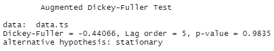
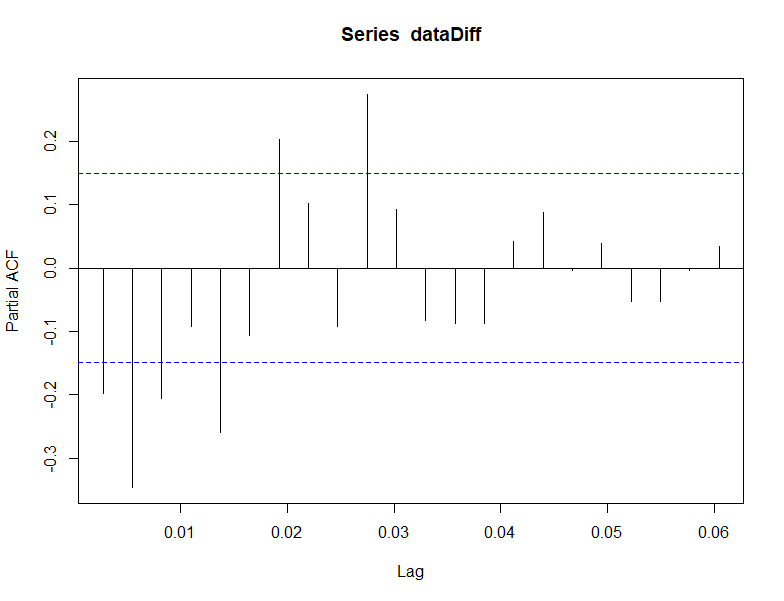

# Covid-19 daily cases forecast using ARIMA model

## Description and Objective :

The main objective of this study is to analyze and predict the health situation linked to covid-19 in our country based on reported daily cases.

## Epidemiological study with time series :

1) **Plot data and understand the pattern of the data**

Before starting our study, we visualize the data (coronadata.csv) and decide on the stationarity of the series.

Stationarity is required for modeling and estimation. A Dickey-Fuller test is performed to verify stationarity.

We have p-value = 0.9835 ( larger than 0.05), meaning the we cannot reject the null hypothesis stating that the time series is non-stationary. This result requires us to differentiate the data (remove the trend) or add a trend.

2) **Apply a differencing to remove the trend and stabilize the variance**

After differencing, the time series is well centered around 0 (as shown below).

This time, the p-value is less than 0.05, we reject the null hypothesis, and assume that the time series is stationary.

3) **Plot the ACF and PACF to maybe estimate the order of the MA or AR process**

To determine the model or the nature of the process adequate for the time series, the autocorrelations and the partial autocorrelations are calculated.

As you can see, we cannot infer the order of the ARIMA(p,0,q) process by looking at these plots. In fact, looking closely, we can see some sinusoidal shape in both ACF and PACF functions. This suggests that both AR(p) and MA(q) processes are in play.

4) **Try different combinations of orders and select the model with the lowest AIC**

We will need try different combinations of orders, fit an ARIMA model with those orders, and use the AIC criterion for order selection. The lowest AIC i found is taken from the ARIMA(2,0,2) model. To verify this claim, i used auto.arima :

The estimation of ARIMA(2,0,2) model is shown below :

5) **Check the residuals and make sure that they look like white noise**

The final part of modelling a time series is to study the residuals. Ideally, the residuals will be white noise, with no autocorrelation.

The ACF plot above doesn't resemble to white noise, wich means that this model is not the best suited for our series even though it has the lowest AIC .

6) **Forecast plot** 

The ARIMA model should not be concidered for forecasting because of its poor performance. This forecast plot is presented only for the sake of visualising how the forecast would look like.

